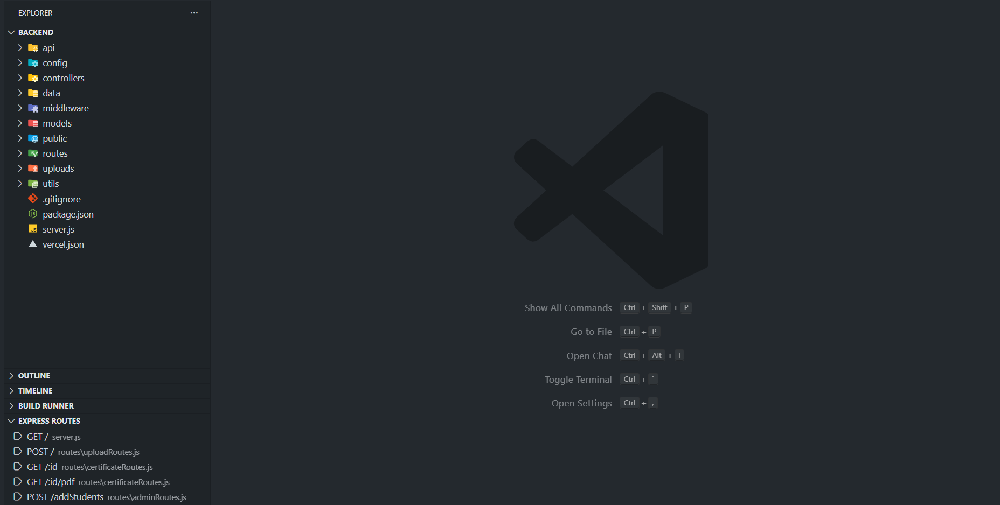

# Express Route Explorer

Visual map of your Express.js routes, right inside VS Code.

**Express Route Explorer** scans your workspace for Express route definitions (like `app.get('/users', ...)` and `router.post('/login', ...)`) and shows them in a dedicated tree view. Click any route to jump straight to its handler.

Perfect for Node.js / Express developers who are tired of hunting through multiple files to find where an endpoint is defined.

---

## ✨ Features

- 🔍 **Auto-detect Express routes**
  - Finds common patterns like:
    - `app.get('/users', handler)`
    - `router.post('/login', handler)`
    - `router.put('/items/:id', handler)`
  - Supports JS and TS files out of the box.

- 🗺️ **Visual route list**
  - See all discovered routes in a single **“Express Routes”** panel.
  - Each item shows HTTP method + path (e.g. `GET /users`, `POST /login`).
  - Shows the file where the route lives.

- ⚡ **Jump to handler**
  - Click a route in the tree → VS Code opens the file and moves the cursor to the route definition.

- 🔁 **Manual refresh**
  - Changed a route or added a new one?  
    Use the **Refresh** command to rescan your workspace.

> 💡 This is an early version focused on **basic route discovery and navigation**. More advanced features (grouping, duplicate detection, validation/error hints) are planned.

---

## 📥 Installation

From VS Code:

1. Open the **Extensions** view (`Ctrl+Shift+X`).
2. Search for **“Express Route Explorer”**.
3. Click **Install** on the extension by **sujalrana**.
4. Reload VS Code.

Or install from the Marketplace page directly `https://marketplace.visualstudio.com/items?itemName=sujalrana.express-route-explorer`.

---

## 🚀 Getting Started

1. Open your **Node.js / Express project** folder in VS Code.
3. Now you can see your all routes just, Click on bottom left Express Routes Section

<p>
  
</p>

3. Make sure your routes are defined using standard Express patterns, e.g.:

   ```js
   const express = require('express');
   const app = express();
   const router = express.Router();

   app.get('/users', (req, res) => {
     res.json({ users: [] });
   });

   router.post('/login', (req, res) => {
     res.json({ ok: true });
   });

   app.use('/auth', router);

