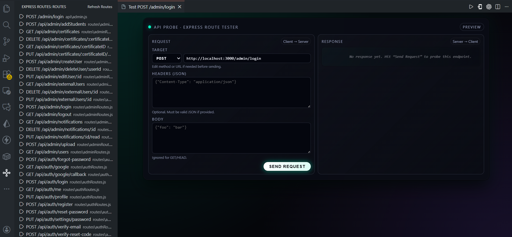
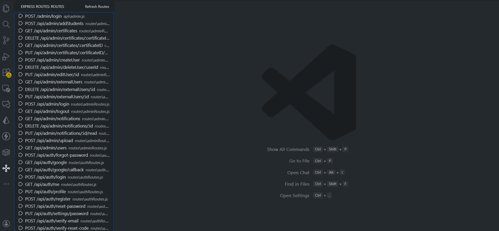

# Express Route Explorer

Visual map of your Express.js routes, right inside VS Code.

**Express Route Explorer** scans your workspace for Express route definitions (like `app.get('/users', ...)` and `router.post('/login', ...)`), understands mounted routers and prefixes, and shows everything in a dedicated tree view. Click any route to jump straight to its handler – or open a built-in Postman-style tester to try the API on the spot.

Perfect for Node.js / Express developers who are tired of hunting through multiple files to find where an endpoint is defined.

---

## ✨ Features

- 🔍 **Auto-detect Express routes**
  - Finds common patterns like:
    - `app.get('/users', handler)`
    - `router.post('/login', handler)`
    - `router.put('/items/:id', handler)`
  - Supports `.js`, `.ts`, `.jsx`, `.tsx` files.

- 🧩 **Prefix & router awareness**
  - Understands mounted routers and constants:
    ```js
    const API_PREFIX = '/api/v1';

    const audioStreamRoutes = require('./routes/audioStreamRoutes');
    app.use(`${API_PREFIX}`, audioStreamRoutes);

    // routes/audioStreamRoutes.js
    router.get('/audio/chunk', handler);
    ```
  - Shows the full resolved route:
    ```text
    GET /api/v1/audio/chunk
    ```
  - Handles:
    - `app.use('/api/v1', router)`
    - `app.use(API_PREFIX, router)`
    - `app.use(API_PREFIX + '/v2', router)`
    - Route paths like `` `${API_PREFIX}/legal/:id` `` or `API_PREFIX + '/legal/:id'`.

- 🗺️ **Visual route list**
  - See all discovered routes in a single **“Express Routes”** panel (own icon in the Activity Bar).
  - Each item shows HTTP method + full path (e.g. `GET /users`, `POST /api/v1/login`).
  - Shows the file where the route lives and sorts routes nicely.

- ⚡ **Jump to handler**
  - Click a route in the tree → VS Code opens the file and moves the cursor to the route definition.

- 🧪 **“Try This API” tester (built-in)**
  - Right-click any route → **“Try This API”**.
  
  - Opens a neon, minimal API client in a Webview:
    - Method and URL are auto-filled from the route (e.g. `GET http://localhost:3000/api/v1/users`).
    - Base URL is guessed from `.env` (`BASE_URL`, `API_URL`, `API_BASE_URL`, `VITE_API_URL`, etc.) or defaults to `http://localhost:3000`.
    - Edit method, URL, headers (JSON), and body, then click **Send Request**.
    - Response panel shows status, headers, and pretty-printed JSON (when applicable).
    
    - 
- 🔄 **Live updates + manual refresh**
  - File watcher automatically rescans when you create, change, or delete JS/TS files (excluding `node_modules`).
  - You can still manually rescan via the **Refresh** button in the view title or the **Refresh Routes** command.

> 💡 This is still evolving – more advanced features (grouping by router/file, Swagger/OpenAPI export, validation/hints) are on the roadmap.

---

## 📥 Installation

From VS Code:

1. Open the **Extensions** view (`Ctrl+Shift+X` / `Cmd+Shift+X`).
2. Search for **“Express Route Explorer”**.
3. Click **Install** on the extension by **sujalrana**.
4. Reload VS Code.

Or install from the Marketplace page directly:  
`https://marketplace.visualstudio.com/items?itemName=sujalrana.express-route-explorer`.

---

## 🚀 Getting Started

1. Open your **Node.js / Express project** folder in VS Code.
2. In the **Activity Bar** (left side), click the **Express Routes** icon.  
   This opens the **“Routes”** tree view contributed by the extension.

   <p>
     
   </p>

3. Make sure your routes are defined using standard Express patterns, e.g.:

   ```js
   const express = require('express');
   const app = express();
   const router = express.Router();

   app.get('/users', (req, res) => {
     res.json({ users: [] });
   });

   router.post('/login', (req, res) => {
     res.json({ ok: true });
   });

   app.use('/auth', router);
